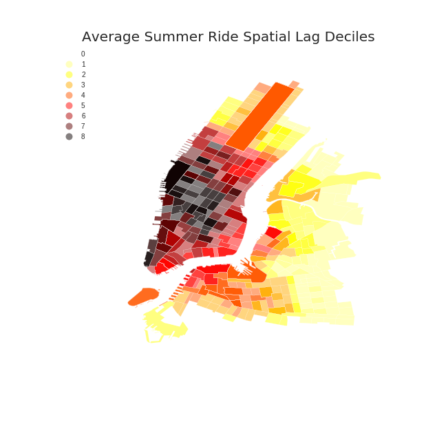
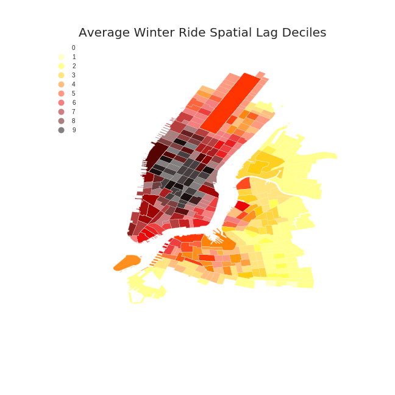
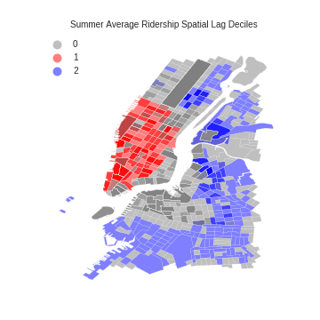
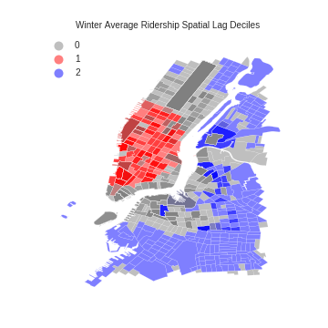

## HW10 Assignment 1 & 2

### I used summer and winter data as two of my analysis datasets, as the seasonal decomposition plot suggests (peak and dip).
- Summer data: July - September of year 2013, 2014 and 2015
- Winter data: January - March of year 2014, 2015 and 2016 

### Year difference due to date limitation of the original monthly citi bike ridership data. 
 
### Then I calculated the average ridership of summer/winter in all stations. 

Figure 1 & 2 shows there is difference in the **(1)active scale** and **(2)activity density** between two seasons: 
- People ride more in summer
- People living in upper Manhattan ride bikes in winter more than summer

Figure 3 & 4 shows geographical relationship in the neighboring area of ridership. 
- Winter affects more in boroughs other than Manhattan, e.g. Brooklyn, possibly mean that people are less likely to use Citi Bikes in South area of NYC between Jan - March. 

Figure 1 

Figure 2 

Figure 3

Figure 4
