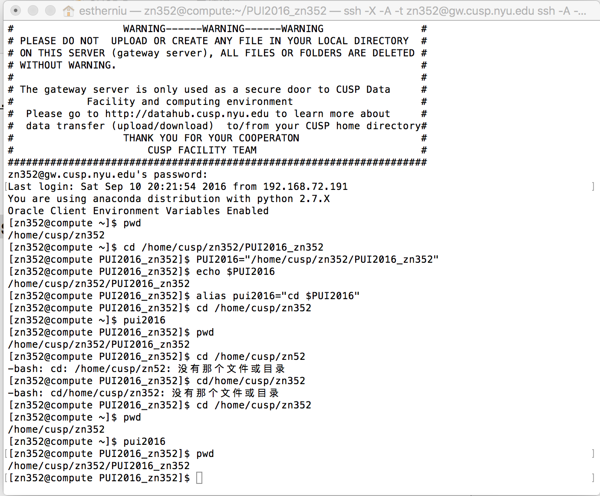

# PUI2016 HW1

## Assignment 1: Finish Lab 1

### I worked on my own. At first creating local directories is fluent, until I encountered 2 main problems: 

1. I could not quit emacs editing =>> found solution contol+z to terminate.
2. git error "fatal: cannot do a partial commit during a merge". 
Unfortunately I tried severy times to commit in the bash and failed. 
I googled it and found solution in [stackoverflow](http://stackoverflow.com/questions/5827944/git-error-on-commit-after-merge-fatal-cannot-do-a-partial-commit-during-a-mer)

   ```
	 git commit -i myfirstfile.txt
 	```


This will do.

### I asked my classmate yw2278 to pair up.


## Assignment 2: Set up my environment: 

1. Didin't encounter much of a problem
2. Sometimes get confused about echo and alias
3. read through bash tutorial and figured it out.


