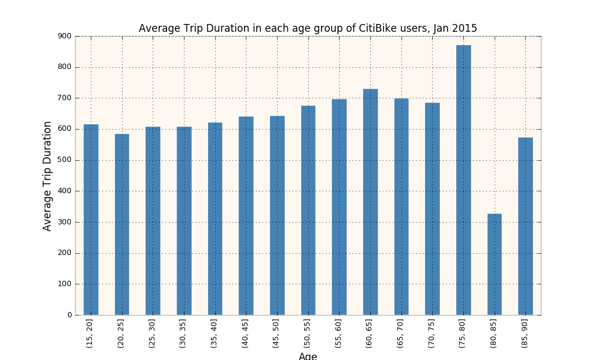

### Figure 1: This figure displays the average trip duration time in seconds for CitiBike users in age groups 15 to 90 years old. We do not see significant differences between each group, although in (75,80] age group the average time spend riding CitiBike is much higher comparing to other age groups, while in (80,85] age group, we observe a dip. It would be interesting to investigate what the peak and dip correspond to - we can speculate that the sample data might not be representative enough in those categories, given only one month of data (Jan 2015), or that elder CitiBike riders (supposingly above 75 years old) have less steady consumer-behavior-routine than that of younger riders.

Data Source: CitiBike Open Data of Jan 2015
