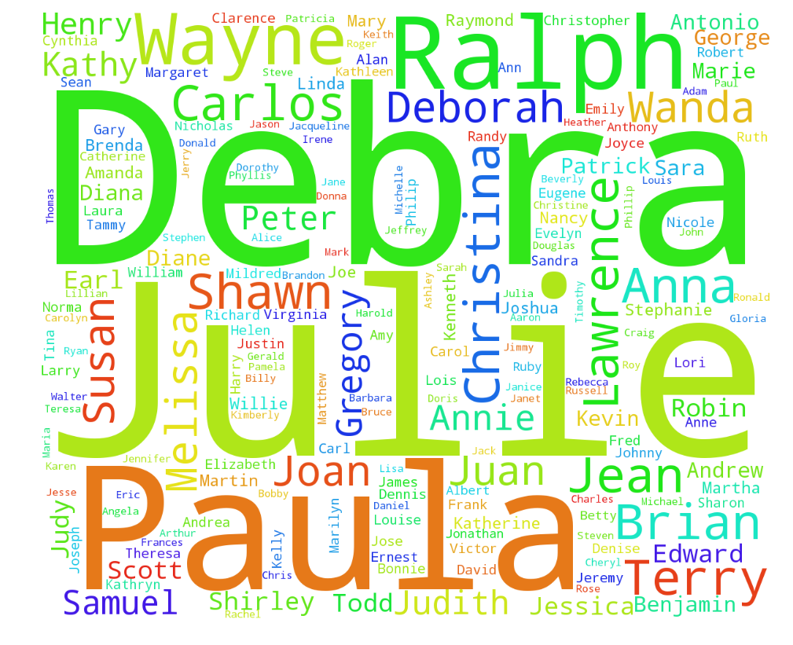

# Review Plot_pgm293 from Zhaohong (zn352) 

## Review
What I like of this wordcloud is that it does have a visual impact on readers, strongly conveys key messages(3 most frequent names). Also very colorful and well-organized. However, it may be consufing at first to see a plot like this without title or any other notation to clarify your purpose, analysis and finding of data. I can understand that you want to use a mock dataset as an example for text analysis. My suggestion is to use data from social media, e.g. Twitter labels within a certain period of time/event to examine heated discussion in the internet. 
